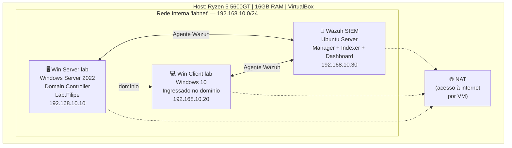
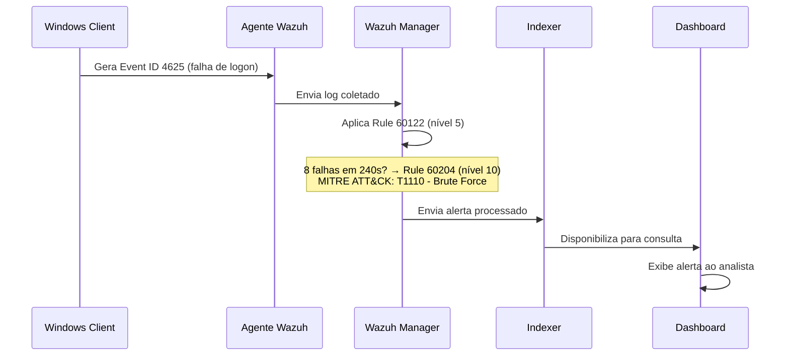

# 🛡️ Home Lab de SOC: Active Directory + SIEM (Wazuh)

Laboratório prático simulando um ambiente corporativo de pequeno porte, com um
domínio **Active Directory** monitorado por um **SIEM (Wazuh)**, construído do
zero para treinar detecção de ameaças, correlação de eventos de segurança e
troubleshooting de infraestrutura real.

> 📌 Este projeto documenta não só o resultado final, mas o **processo real**
> de construção — incluindo os erros, diagnósticos e soluções ao longo do
> caminho, que foram tão valiosos de aprender quanto o resultado em si.

---

## 🎯 Objetivo

Simular, numa escala reduzida, o dia a dia de um analista de SOC:
- Configurar e administrar um domínio Windows (Active Directory)
- Implantar um SIEM open source (Wazuh) monitorando os endpoints
- Detectar e interpretar eventos de segurança reais do Windows
- Simular um ataque de força bruta e validar a detecção via correlação de
  regras, classificada segundo o framework **MITRE ATT&CK**

---

## 🏗️ Arquitetura

Cada VM tem duas placas de rede: uma na **Rede Interna (labnet)**, isolada,
para a comunicação entre as máquinas do laboratório; e uma em **NAT**, usada
individualmente por cada VM só para acesso à internet (necessário, por
exemplo, para o Ubuntu baixar os pacotes de instalação do Wazuh).

---

## 🛠️ Stack

| Componente | Tecnologia |
|---|---|
| Hipervisor | Oracle VirtualBox |
| Domain Controller | Windows Server 2022 (AD DS) |
| Endpoint monitorado | Windows 10 |
| SIEM | Wazuh 4.14 (Manager + Indexer + Dashboard) |
| SO do SIEM | Ubuntu Server 24.04 LTS (LVM) |
| Acesso remoto | SSH (port forwarding via NAT) |

---

## 📋 O que foi implementado

1. **Domínio Active Directory funcional** (`Lab.Filipe`) — DC promovido, Client
   ingressado, autenticação testada com administrador e usuário comum
2. **SIEM Wazuh monitorando os dois endpoints Windows** via agentes instalados
   em cada máquina
3. **Detecção de evento isolado de falha de login**
   — Windows Event ID `4625` → Wazuh Rule ID `60122` (nível 5)
4. **Detecção de ataque de força bruta via correlação de eventos**
   — Wazuh Rule ID `60204` (nível 10), classificado pelo próprio Wazuh segundo
   o **MITRE ATT&CK** como técnica **T1110 (Brute Force)**, tática
   **Credential Access**
5. **Migração completa do SIEM** de um appliance pronto (OVA) para uma
   instalação Ubuntu construída do zero, por limitação de disco (ver seção
   de problemas abaixo)

---

## 🐛 Problemas reais enfrentados e soluções

Esta seção documenta os principais obstáculos técnicos do processo — cada um
seguindo o formato **Problema → Diagnóstico → Solução**.

### 1. Disco cheio no appliance OVA original
- **Problema:** o Wazuh (appliance OVA v4.14.6, Amazon Linux 2023) parou de
  processar eventos novos.
- **Diagnóstico:** o disco de 25GB estava 100% cheio. O módulo
  *Vulnerability Detector* havia consumido ~18GB em `/var/ossec/queue/vd` e
  `vd_updater`.
- **Solução:** em vez de redimensionar o disco existente, recriei o SIEM do
  zero numa VM Ubuntu Server 24.04 com 60GB em LVM, ajustado manualmente na
  instalação para evitar espaço não alocado — dando mais controle e margem
  de crescimento.

### 2. Ausência de ferramentas gráficas de rede no Amazon Linux (OVA antigo)
- **Problema:** o appliance OVA não tinha `nmcli`/`nmtui` disponíveis.
- **Solução:** configuração de rede manual via arquivos `ifcfg-eth1`,
  habilitando o serviço legado `network` via `systemctl`.

### 3. Erro de sintaxe no Netplan (Ubuntu novo)
- **Problema:** `netplan apply` retornava `unknown key 'set-name'`.
- **Diagnóstico:** um bloco `match`/`set-name` desnecessário (a interface já
  se chamava `enp0s3` nativamente) estava causando conflito de indentação
  YAML.
- **Solução:** simplificação do arquivo, removendo o bloco `match` e
  definindo o IP fixo diretamente na interface.

### 4. Timeout do `wazuh-manager.service` após boot a frio
- **Problema:** depois de desligar a VM (para aumentar a RAM alocada) e
  religá-la, o serviço do Wazuh Manager falhava com
  `start operation timed out` e não subia sozinho.
- **Diagnóstico:** logo após um boot a frio, múltiplos serviços pesados do
  Wazuh (Manager e Indexer, este último baseado em OpenSearch/JVM) tentam
  inicializar simultaneamente, disputando CPU e I/O de disco num momento em
  que o cache do sistema ainda está vazio — facilmente ultrapassando o
  timeout padrão de 45 segundos do systemd.
- **Solução:** criação de um override systemd
  (`/etc/systemd/system/wazuh-manager.service.d/override.conf`) aumentando
  o `TimeoutSec` para 300 segundos, dando margem suficiente para a
  inicialização completa em qualquer cenário de boot.

### 5. Investigação de aparente falha na correlação de força bruta
- **Problema:** após 7-8 tentativas de login falho, o alerta de correlação
  (Rule ID `60204` — Multiple Windows Logon Failures) não aparecia no
  Dashboard.
- **Diagnóstico:** investigação em camadas — (1) leitura do ruleset em
  `/var/ossec/ruleset/rules/0580-win-security_rules.xml`, confirmando que a
  regra exige `frequency=8` falhas em `timeframe=240` segundos; (2)
  confirmação de que o campo `win.eventdata.ipAddress` estava consistente
  (`127.0.0.1`, logon local tipo 2) entre todas as tentativas; (3) inspeção
  direta do `alerts.json` no servidor, onde o alerta `60204` **de fato
  constava**, corretamente classificado com MITRE ATT&CK T1110.
- **Conclusão:** não havia falha na correlação — o alerta existia, só não
  estava sendo exibido no período/filtro selecionado no Dashboard. Esse
  processo de descartar hipóteses (ruleset → dado bruto → camada de
  visualização) foi um exercício real de troubleshooting em profundidade.

---

## 🔍 Anatomia da detecção: do evento bruto ao alerta correlacionado

- **Agente**: coleta os logs de segurança locais do endpoint (`Security.evtx`)
- **Manager**: aplica as regras do ruleset, decidindo severidade e correlação
- **Indexer**: armazena os alertas já processados para consulta rápida
- **Dashboard**: interface de visualização, consulta o Indexer sob demanda

---

## 📸 Evidências

| Descrição | Print |
|---|---|
| Evento isolado de falha de login (Rule 60122) | `assets/screenshots/single-logon-failure.png` |
| Alerta de força bruta correlacionado (Rule 60204, nível 10) | `assets/screenshots/brute-force-alert.png` |
| Detalhes do alerta com classificação MITRE ATT&CK | `assets/screenshots/mitre-classification.png` |
| Visualizador de Eventos do Windows confirmando múltiplas falhas | `assets/screenshots/eventvwr-failures.png` |
| Dashboard de Endpoints com agentes ativos | `assets/screenshots/endpoints-active.png` |

---

## 📚 Aprendizados

Este projeto foi minha primeira experiência prática aprofundada em segurança
da informação, além dos cursos introdutórios de Python e da trilha gratuita
de Nmap/Wireshark no TryHackMe. Os principais aprendizados técnicos foram:

- A diferença entre um **evento de segurança isolado** e uma **detecção de
  padrão via correlação de regras** — e por que essa separação existe:
  evitar *alert fatigue*, permitindo que o analista foque em anomalias
  comportamentais (ex: velocidade de tentativas incompatível com um ser
  humano) em vez de eventos individuais normais.
- Diagnóstico de serviços Linux via `systemctl`/`journalctl`, incluindo
  ajuste de timeouts do systemd para lidar com inicializações sob carga.
- Leitura e interpretação de logs brutos do Windows (Event Viewer e JSON de
  alertas do Wazuh), incluindo campos como `logonType` e `ipAddress`.
- A importância de **confirmar hipóteses na fonte de dados bruta** antes de
  concluir que algo "não funcionou" — o caso do alerta 60204 me ensinou a
  não confiar cegamente numa interface gráfica sem checar a camada de dados
  por trás dela.

---

## 👤 Autor

**Filipe Cavalcanti Borges**
Estudante de Tecnologia em Defesa Cibernética
[LinkedIn](https://www.linkedin.com/in/filipe-cavalcanti-borges-316579296) · [GitHub](https://github.com/filipecavalcantiborges)
